# Smart Farm 🚜

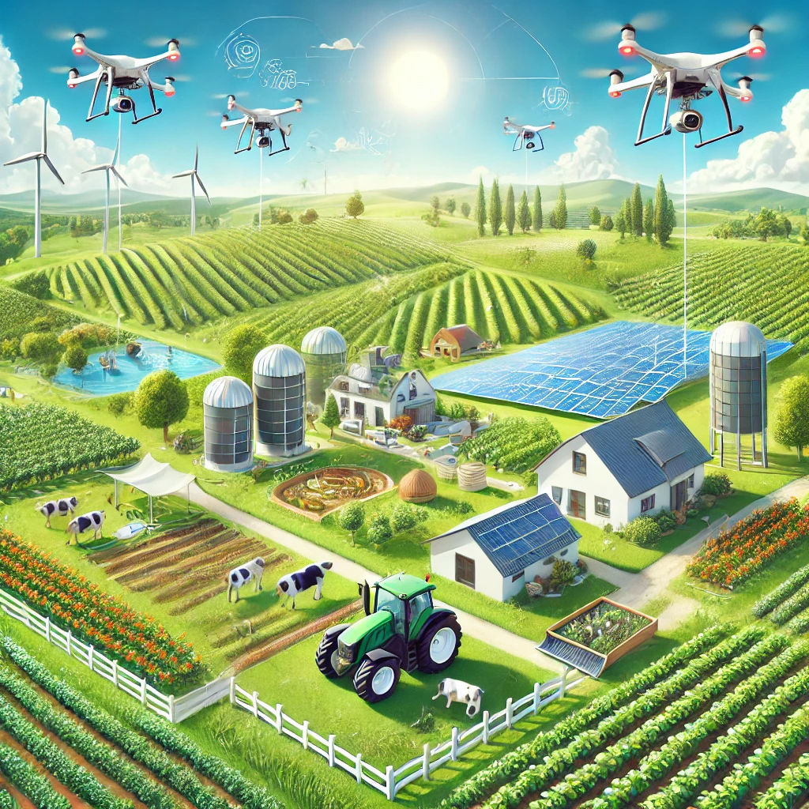

**Team:**
- [Arutyunyan Vazgen](https://gitlab.fel.cvut.cz/arutyvaz) 👨‍🌾
- [Stepaniuk Vitalii](https://gitlab.fel.cvut.cz/stepavi2) 🧑‍🌾

## Popis 🌾
Vytvoření aplikace pro virtuální simulaci chytré farmy, kde je modelována péče o zemědělské plodiny a zvířata, správa techniky, správa zdrojů a organizace pracovního dne farmářů.

## Funkční požadavky 🌽

1. **Správa farmy**  
   Aplikace umožňuje správu farmy zahrnující:
    - Péči o zemědělské plodiny.
    - Správu zvířat a jejich stavu.
    - Správu strojů a jejich údržbu.
    - Organizaci práce farmářů.

2. **Monitorování a notifikace**
    - Stav jednotlivých částí farmy (např. stroje, pole, farmáři) je automaticky sledován.
    - Upozornění na důležité události nebo změny je generováno v reálném čase.

3. **Automatizace činností**
    - Úkoly farmářů a správa farmy jsou optimalizovány pomocí systému automatizace.
    - Každý úkol je zpracováván prostřednictvím předdefinovaného řetězce odpovědností (Chain of Responsibility).

4. **Flexibilní konfigurace**
    - Farma je konfigurovatelná prostřednictvím externího JSON souboru.
    - Uživatel může definovat počáteční stav farmy, včetně počtu polí, farmářů a strojů.

5. **Záznam událostí**
    - Všechny události jsou zaznamenávány do systému logování, což usnadňuje zpětnou analýzu.
    - Logy jsou generovány ve formátu textových souborů.

6. **Stavový management**
    - Každý prvek farmy má svůj stavový model, který umožňuje přechody mezi stavy.
   
7. **Strategie dat**
    - Aplikace podporuje různé strategie pro zpracování dat, například ukládání dat do konzole nebo jiného výstupního zařízení.

8. **Tvorba objektů**
    - Pro snadnou inicializaci farmy se využívá Factory pattern pro tvorbu objektů jako jsou farmáři, stroje nebo pole.

9. **Uživatelská přívětivost**
    - Rozhraní aplikace je intuitivní a poskytuje jednoduché ovládání simulace farmy.

## Nefunkční požadavky 🪚

1. **Jednoduchost implementace**
    - Aplikace je navržena pro běh v jedné JVM instanci bez potřeby složité distribuce.

2. **Bezpečnost a skrytí detailů**
    - Metody a proměnné, které nejsou určeny pro externí použití, jsou skryty pomocí principů zapouzdření.

3. **Bez autentizace**
    - Pro použití aplikace není vyžadována autentizace ani autorizace uživatele.

4. **Jednoduché zprávy**
    - Generované výstupy a logy jsou ve formátu jednoduchého textu, snadno čitelné a přehledné.

5. **Externí konfigurace**
    - Nastavení farmy, jako například počet polí, strojů a farmařů, je načítáno z externího JSON souboru, což zajišťuje flexibilitu.

6. **Optimalizace výkonu**
    - Aplikace je optimalizována pro plynulý běh na standardním hardwaru bez požadavků na vysoký výpočetní výkon.

## Design patterny  🌻
- Observer
- Factory
- Adapter
- Chain of responsibility
- Strategy
- State
- Builder
- Dependency injection
- Singleton

# Výstupy

### Use case diagram
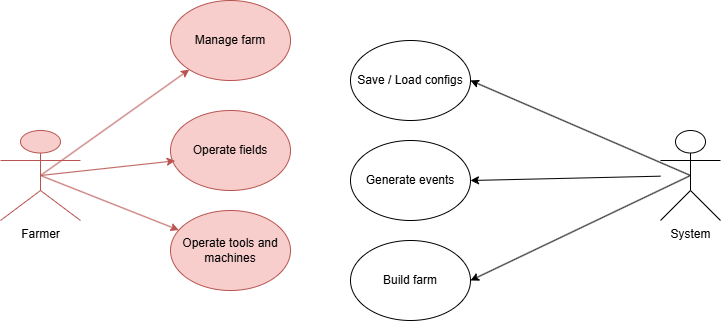

## Class diagrams

## Builder

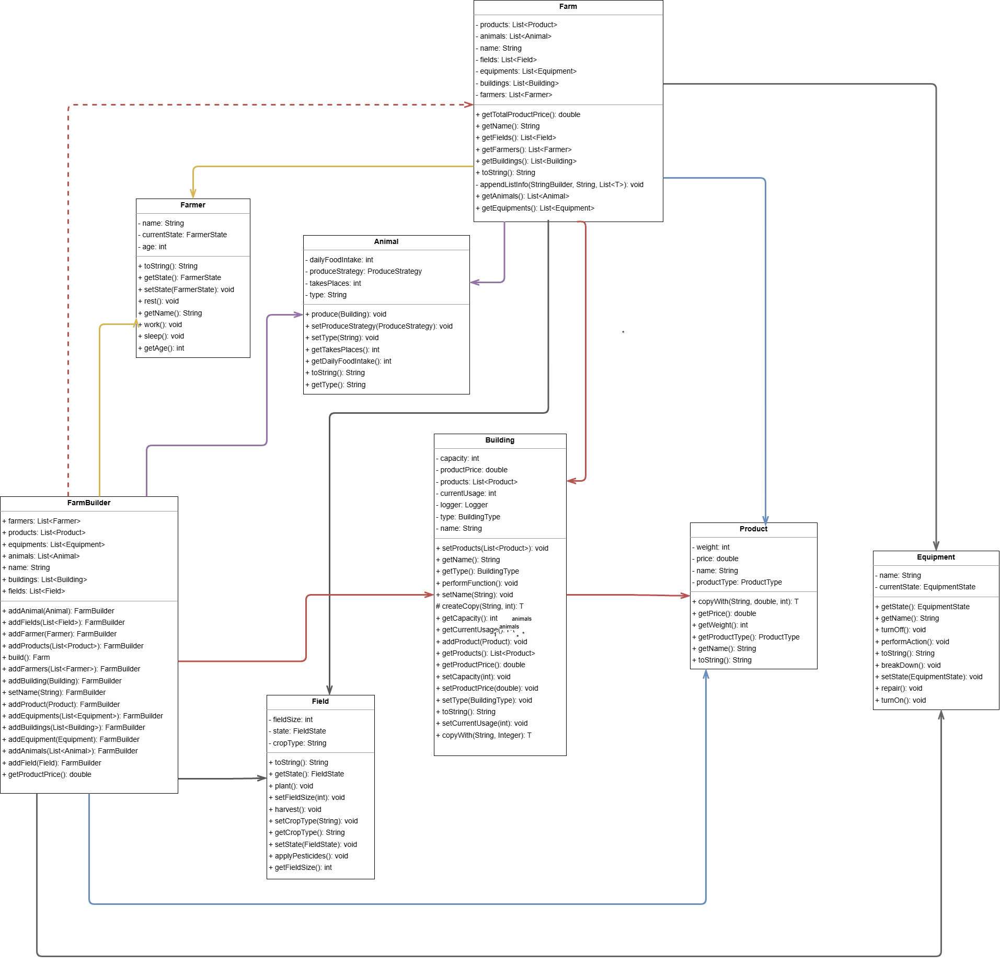

## Adapter
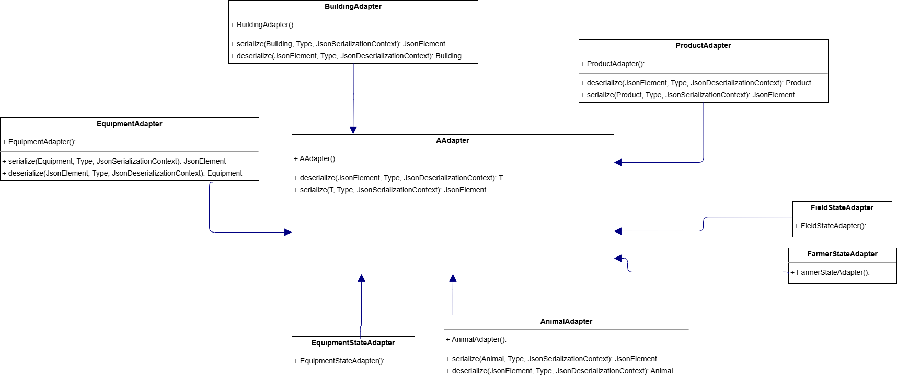

## Chain of responsibility
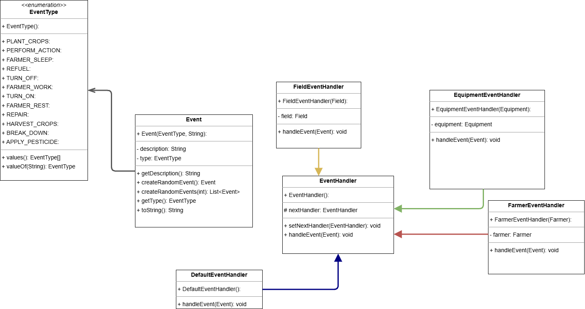

## Factory
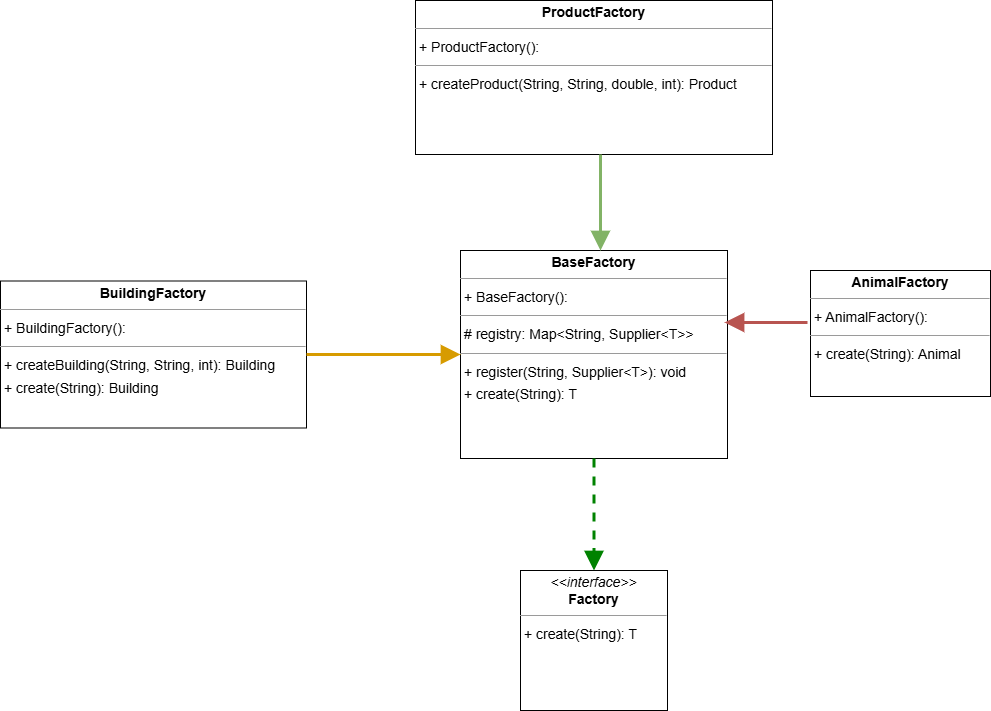

## Observer
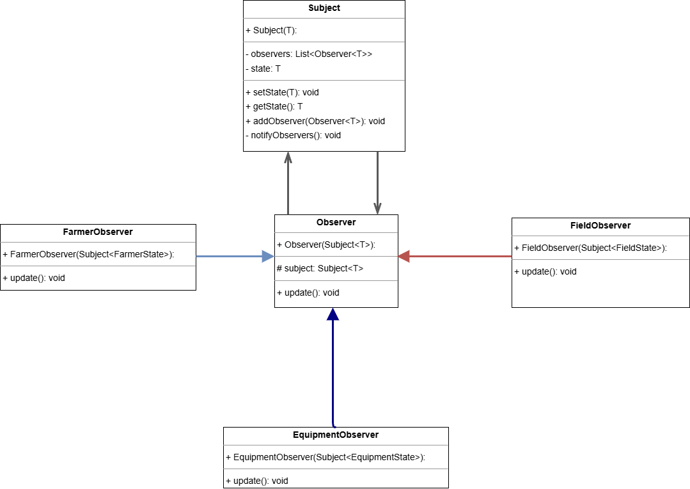

## State
#### Farmer state
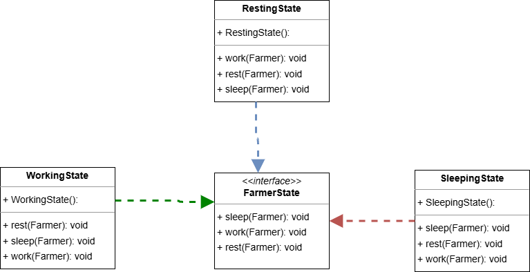
#### Field state
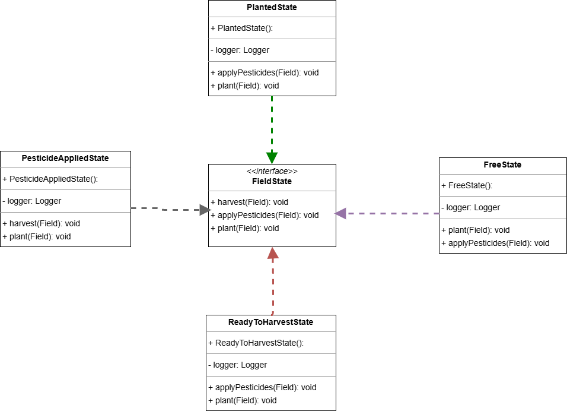
#### Equipment state
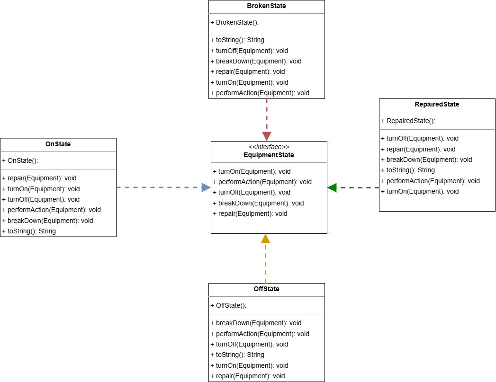

## Strategy
#### Data strategy
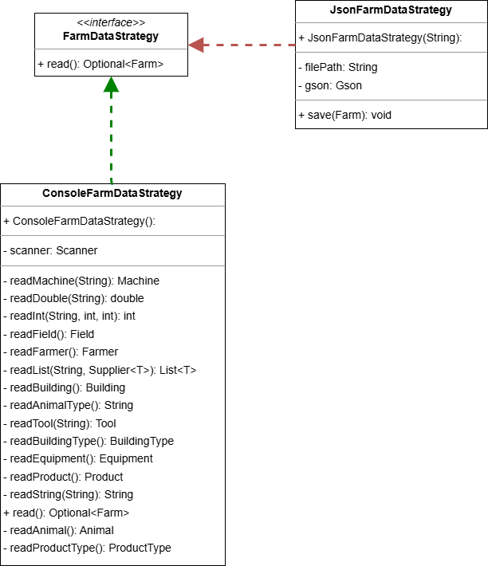

#### Log Strategy
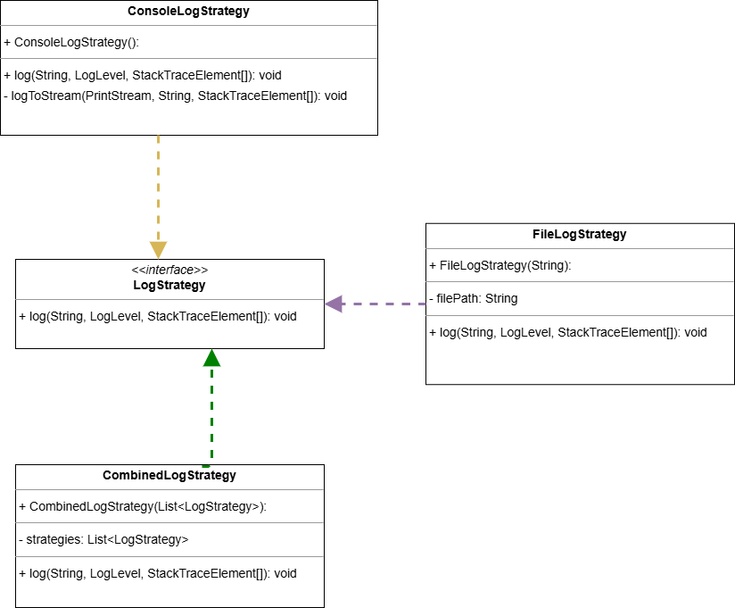

#### Produce strategy
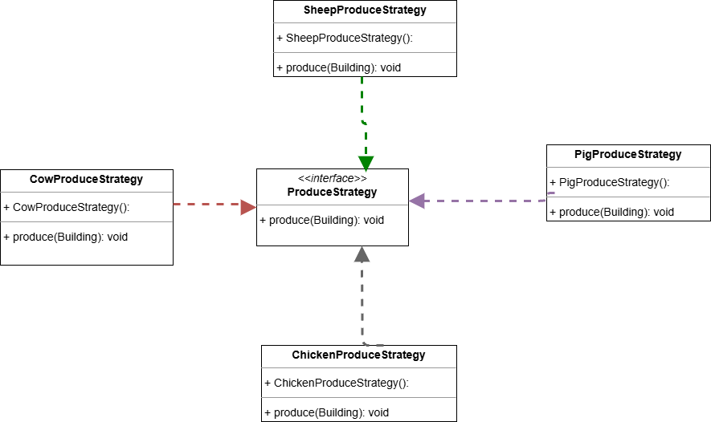

# Dokumentace

Dokumentace vygenerovaná pomocí Javadoc je dostupná ve složce `docs/javadoc`.

Uživatelská dokumentace je v souboru `docs/userDoc.pdf`.